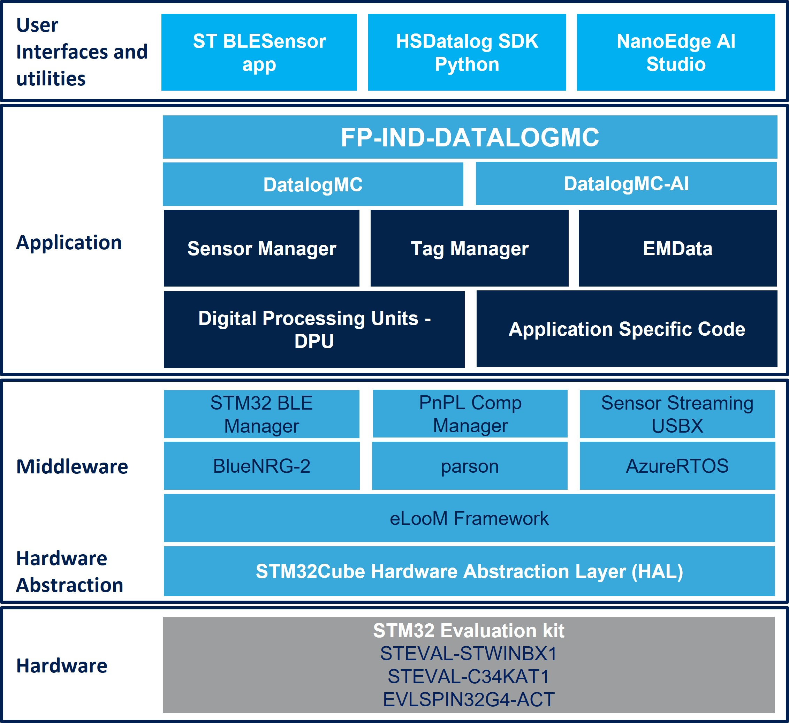

# FP-IND-DATALOGMC Firmware Package

**Please check st.com where a more recent version of the software might be available.**

The **FP-IND-DATALOGMC** function pack for **STEVAL-STWINBX1** and **EVLSPIN32G4-ACT** is a powerful integrated toolkit for the next generation of smart
actuators. It is derived from a **FP-SNS-DATALOG2** function pack and it allows the collection of heterogeneous data, combining STWIN.box sensor information with
STSPIN32G4 motor control data and it provides a comprehensive view of the system’s operational conditions. This enables both real-time monitoring and accurate
performance assessment.

EVLSPIN32G4-ACT is designed to drive a variety of three-phase brushless DC motors (not included in the kit) and ready for FOC control algorithms. See UM for
further details and installation guide. The list of supported motors is provided in the motor control SDK documentation (**X-CUBE-MCSDK-6**).

The function pack includes a Python GUI, hsdatalogMC_GUI that communicates with the STEVAL-STWINBX1 via USB allowing the user to control the motor (start/stop
commands, set velocity) and select a combination of motor control telemetries and sensor data to be logged. The STEVAL-STWINBX1 communicates with the
STSPIN32G4 MCU via serial port (UART), using the motor control protocol (MCPv2). This protocol allows both system configuration and data logging.

The application can be controlled via Bluetooth using the **STBLESensor app** which lets you manage the board and sensor configurations, start/stop data acquisition 
on SD card and control data labelling.

FP-IND-DATALOGMC is based on application-level modules (SensorManager, TagManager, DPU digital processing units) that can be reused and extended to build
its custom application. To enable this modularity, the function pack has been built on top of eLooM, an embedded light object-oriented framework for STM32 applications
specifically designed for embedded low power applications powered by STM32. 

The DATALOGMC application can save data to a microSD™ card (secure digital high capacity - SDHC) formatted with the FAT32 file system, or stream data to a PC via
USB (WCID class). A Python SDK, provided within the function pack, makes it easy to read back and process sensor and motor data acquired using FP-IND-DATALOGMC,
a few ready-to-use scripts, and notebooks are provided.

This firmware package includes Components Device Drivers, Board Support Package and example applications 
for the STWIN.box platform (STEVAL-STWINBX1).  

Here is the list of references to user documents:

- [DB5152](https://www.st.com/resource/en/data_brief/FP-IND-DATALOGMC.pdf) : STM32Cube function pack for high-speed datalogging of sensors data and motor control telemetries
- [STM32Cube](https://www.st.com/stm32cube): STM32Cube

## Known Limitations

- None

## Development Toolchains and Compilers

-   IAR Embedded Workbench for ARM (EWARM) toolchain V9.20.1
-   RealView Microcontroller Development Kit (MDK-ARM) toolchain V5.37
-   STM32CubeIDE v1.13.2

## Supported Devices and Boards

- [STEVAL-STWINBX1](https://www.st.com/stwinbox)
- [EVLSPIN32G4-ACT](https://www.st.com/en/evaluation-tools/evlspin32g4-act.html)

## Backward Compatibility

- None

## Dependencies

- None
